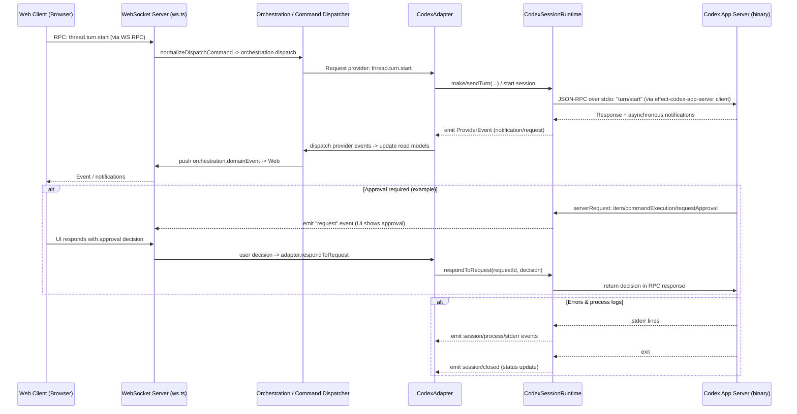

# Fluxo de sessão: Web → Server → Codex CLI

Diagrama sequence (Mermaid) mostrando a interação fim-a-fim entre o cliente web, servidor, adapter e o binário Codex App Server.

> Arquivo gerado: apps/server/codex_session_flow.md
